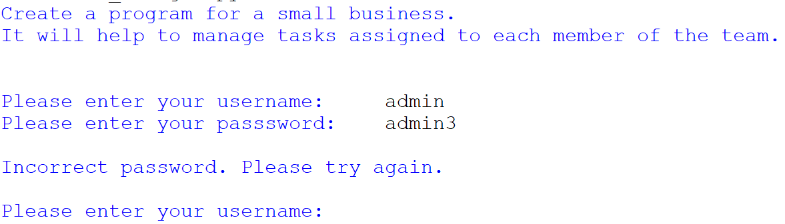
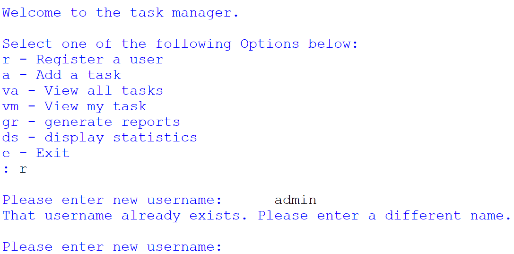
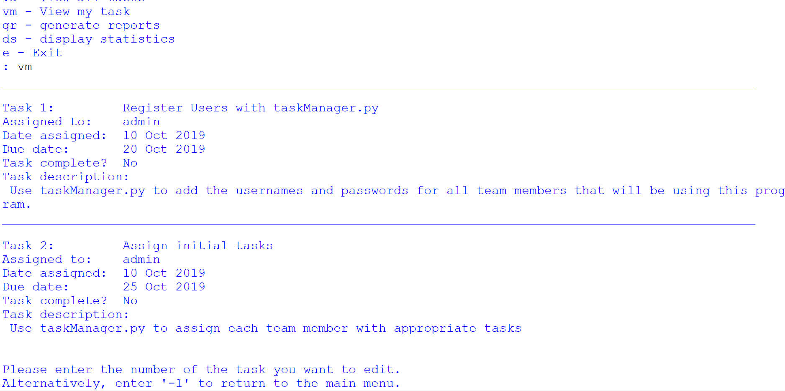
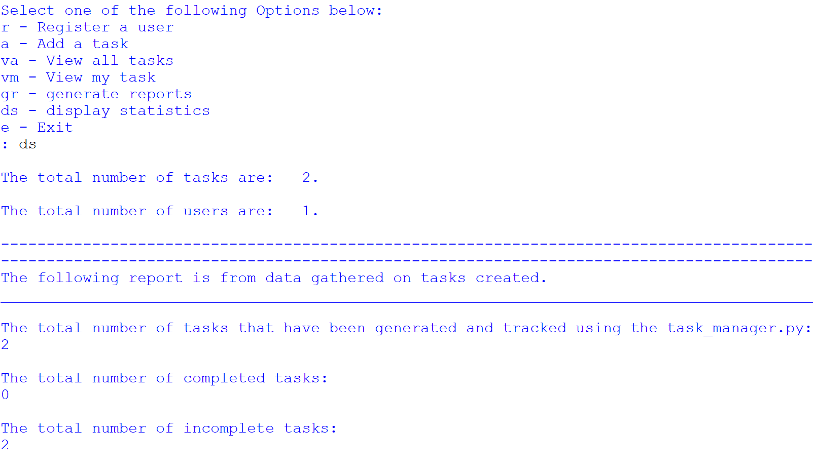
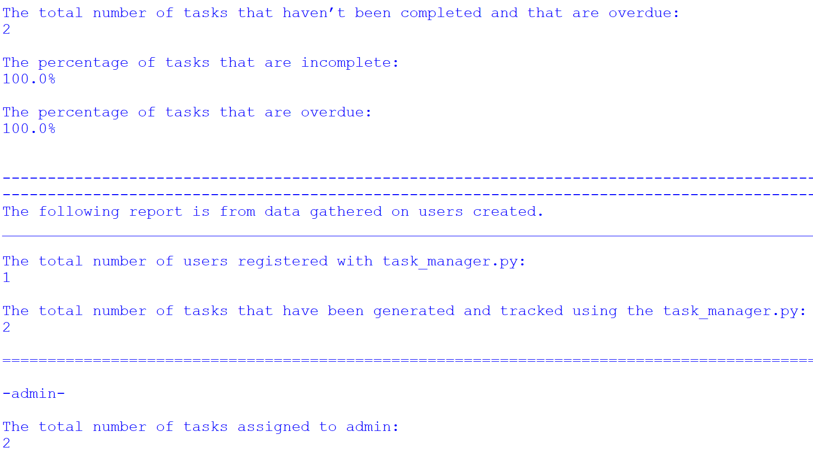
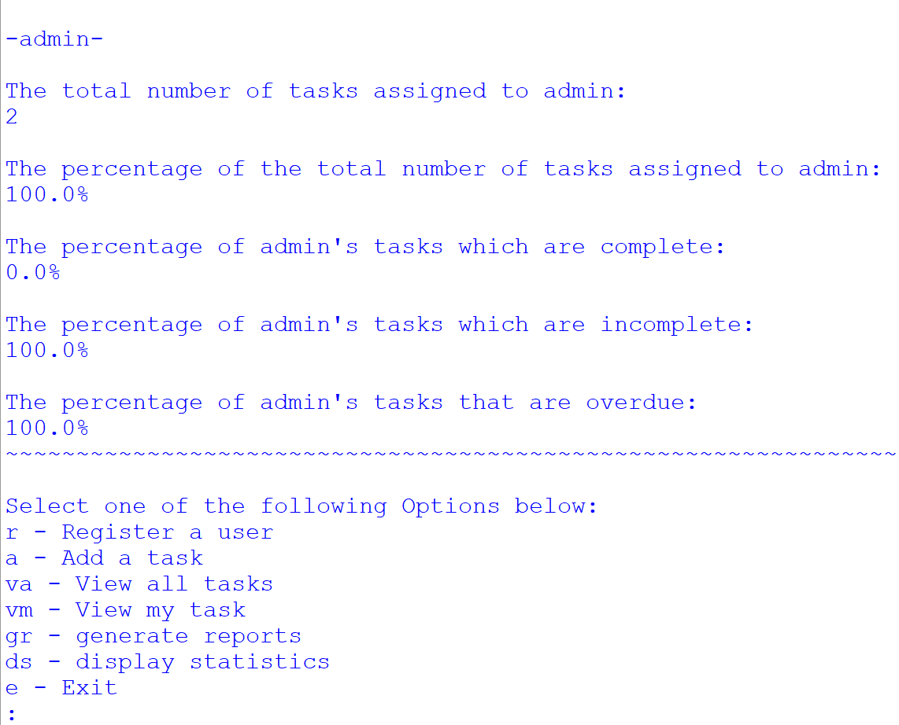
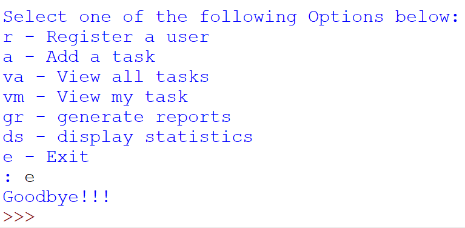

# Project name
Task manager

# Project description

**Importance of the project**

This project plays a pivotal role in teaching and applying essential programming concepts, such as string manipulation, working with external data sources, and implementing conditional logic and loops. It acts as a stepping stone for developers to gain hands-on experience in building practical applications. The significance of this project can be summarized as follows:

1. *Educational Value:* The project provides a comprehensive learning experience, allowing developers to enhance their understanding of string manipulation, file handling, and logical constructs. It serves as a practical exercise to apply theoretical knowledge in a real-world context.

2. *PEP 8 Compliance:* Emphasizing adherence to the PEP 8 style guide ensures that the code follows industry-standard best practices for readability and maintainability. This project instills good coding habits and promotes the creation of clean, organised, and well-documented code.

3. *Task Management Solution:* The project's primary goal is to create a task management application. Task management is an integral part of various industries, helping businesses organise work, track progress, and improve productivity. This project equips developers with the skills to build a fundamental task management system.

**What the project does**

The project evolves in two tasks, with the second task extending the functionality of the first. Together, they create a task management application with various features, as outlined below:

*Task 1: Files*
- The program works with two text files, "user.txt" and "tasks.txt," to store user credentials and task details.
- User functionalities include:
  - User login: Users must enter valid credentials, ensuring secure access to the application.
  - User registration: Admin users can register new users with unique usernames.
  - Task addition: Users can add tasks, specifying assignees, task details, and due dates.
  - Viewing all tasks: All tasks in "tasks.txt" are displayed in an easily readable format.
  - Viewing tasks assigned to a user: Users can view their assigned tasks.
  - Admin privileges: The "admin" user can display statistics, including the total number of tasks and users.

*Task 2: Lists, Functions, and String Handling*
- This task focuses on improving the code structure and adding more functionalities.
- Functions are introduced for improved modularity, making the code more organised.
- Features added include:
  - User registration enhancements: Preventing duplicate usernames during registration.
  - Viewing tasks assigned to the current user with options to mark tasks as complete or edit them.
  - A reports option for generating task and user overviews in user-friendly text files.
- The admin user can access detailed statistics, including the total number of tasks and users, tasks assigned to each user, completion rates, overdue tasks, and more.

In summary, this project facilitates the learning of essential programming concepts and the development of a practical task management application. It enforces coding best practices, readability, and modularity, ensuring that the resulting application is both functional and maintainable. Through two tasks, the project evolves into a comprehensive task management solution with features for user management, task tracking, and insightful reporting.

# Installation section
*Tell other users how to install your project locally*

1. Install Python: 
    1. Download Python IDLE 3.7.0 to run the program
    1. Visit the official Python website at https://www.python.org/downloads/windows/ in your web browser.
    1. Click on the "Download Python 3.7.0" button
    1. Under Files section, download the one that matches your system architecture (32-bit or 64-bit). Most modern systems are 64-bit.
    1. Click on the installer to download it.
    1. Locate the downloaded installer file and double-click on it to run the Python installer.
    1. Check the box that says "Add Python 3.7.0 to PATH." 
    1. Click the "Install Now" button to start the installation process.
     
1. Open the Command Prompt (cmd)
    1. Clone repository: `git clone <repository-url>`
    1. Navigate to the project directory: `cd "path\to\task_manager.py"`

1. Create a Virtual Environment:
    1. Create a folder for new virtual env: `mkdir Virtual_env`
    1. Navigate to folder: `cd Virtual_env`
    1. Create a virtual environment: `virtualenv taskvenv`

1. Activate the Virtual Environment:
    + In Windows Command Prompt (Admin):
    1. In your Virtual_env folder there will be a folder called Scripts. Copy its path.
    1. Change directory to Scripts `cd "path\to\scripts\in\virtual\environment"`
    1. Activate virtual environment: `activate.bat`
    1. You will see (bookshelfvenv) at the start of cmd line
    1. change directory to app root directory: `cd "path\to\app"`

1. Verify Python installation: `python --version`
1. Verify pip installation: `pip --version`
1. Install the dependencies: `pip install -r requirements.txt`    

# Usage section
*Instruct others on how to use your project after they’ve installed it*

*Outline the steps necessary to build and run your application with venv and Docker:*
+ Activate virtual environment [see above]

+ Install Docker desktop @ https://www.docker.com/products/docker-desktop
+ Open Docker Desktop
+ login to Docker Hub @ https://hub.docker.com/

## Use the Command Prompt
1. Check that Docker desktop was successfully installed: `docker run hello-world`
1. Build the docker image: `docker build -t task_manager ./` 
1. Run the docker image: `docker run -it task_manager`
1. Deactivate the Virtual Environment: `deactivate`

## Use Docker Playground
1. Follow: https://labs.play-with-docker.com/
1. Start a new instance

In the terminal: 
1. Copy command from Docker Hub @ https://hub.docker.com/repository/docker/kcse1/task/tags?page=1&ordering=last_updated: `docker pull kcse1/task:manager`
1. Run the docker image: `docker run -it kcse1/task:manager`
1. Close session on Docker Playground

## Use Python IDLE
Run the program (F5) and select an option from the menu

1. Deactivate virtual environment in cmd when you are done working: `deactivate`

*Include screenshots of your project in action*

# Credits
*highlights and links to the authors of your project if the project has been created by more than one person*

@KC-software-en

# Add a URL to your GitHub repository

https://github.com/KC-software-en/bookish-adventure

